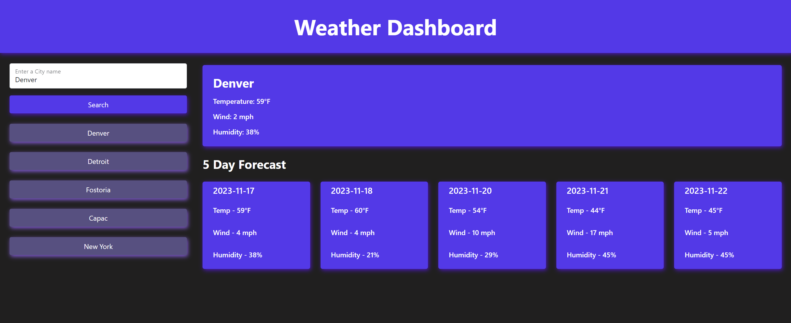

# Weather-App

Simple weather app using HTML, BootStrap, and JavaScript

## Description 

Search for a city and be given the current day forecast displayed at the top with the next 5 days displayed below!

## Usage

Check out your local weather and see how the weather is for the week!

## Dependencies

1. A web browser
2. Internet
3. <a href="https://mscott-dev.github.io/Weather-App/" alt="WeatherApp">A link to the webpage</a>

## Installing
N/A

## Executing program

Just search for a city!

## Authors
Matthew Scott
